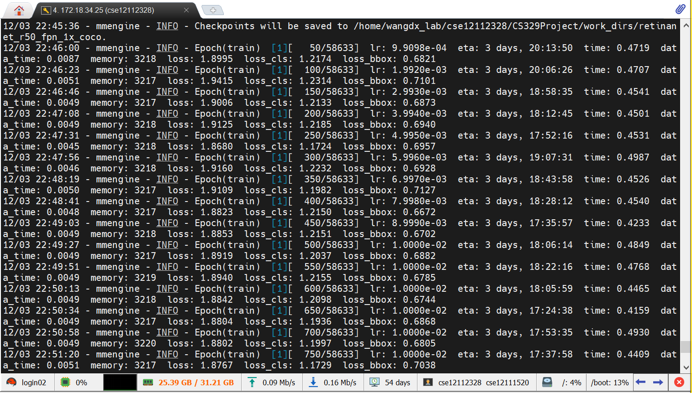

# CS329 Machine Learning（H）Final Project: Shift Step Focal Loss in Object Detection
This is a repository for CS329 Machine Learning（H）Final Project: Shift Step Focal Loss in Object Detection. 

**Abstract**

In the realm of object detection, overcoming the challenge that hinders a one-stage detector from achieving comparable accuracy to a two-stage detector lies in addressing the pronounced foreground-background class imbalance. One viable solution involves reshaping the loss function. This report delves into our exploration aimed at enhancing object detection performance by modifying the Focal Loss, marking a distinctive aspect of our work. 

The evaluation was conducted on the HPC-AI service platform, encompassing the training of four models using both Focal Loss and our proposed innovation, **Shift Step Focal Loss*** (SSFL\*). Results from the experiments reveal a marginal performance improvement in object detection across the coco and cityscapes datasets when employing the proposed SSFL\*. The anticipated enhancement, gauged through average precision (AP), signifies that our model with SSFL* exhibits a slight superiority over the model utilizing the original focal loss. 

However, it is imperative to note that the stability of the model equipped with our proposed SSFL* remains an area of concern. Ensuring a consistent performance, characterized by the avoidance of misdetection and adept detection of concealed vehicles, will be the central focus of our future endeavors.


## 1. Project requirements and tasks

### Requirements

You are required to: 

1. Choose one of these works in the task you have selected, and read its research paper and code. You should fully understand the work and know exactly how to describe it to others. **[Finished]**

2. Reproduce the research paper you have selected on its dataset (if there is an open-source repository of the work you have selected, you can choose to run the code successfully instead of reproducing, but you should know exactly how the code works). **[Finished]**

3. Train and test your code on any autonomous-driving-related dataset that is different from the dataset in the work you have selected. **[Finished]**

4. (Optional) Test your code in the campus. (This part is not required if you choose LiDAR-related task, it is also optional for other tasks) **[Finished]**

   

## 2. Timeline

| Dates      | Events                                                       |
| ---------- | ------------------------------------------------------------ |
| 2023/11/24 | roughly read paper: Focal Loss for Dense Object Detection, we are interested in the design of loss function mentioned in this paper |
| 2023/11/29 | download MMDetection                                         |
| 2023/12/2  | download coco datasets[1] (ZZB)                              |
| 2023/12/3  | train: run retinanet_r50_fpn_1x_coco.py on the HPC-AI service platform (estimated time: 3d 18h) |
| 2023/12/7  | finished the training process(retinanet_r50_fpn, 12 epoch, coco) |
| 2023/12/8  | test the model                                               |
| 2023/12/9  | finished the proposal PPT; Proposal Presentation             |
| 2023/12/10 | finished the proposal report                                 |
| 2023/12/25 | download cityscapes datasets (LDH) Converted cityscapes datasets format[2] |
| 2023/12/25 | train: run retinanet_r50_fpn_1x_cityscapes.py on the HPC-AI service platform (estimated time: 1d 2h) |
| 2023/12/26 | detect loss NAN error                                        |
| 2023/12/29 | adjust `lr` from `0.01` to `0.001` to avoid `loss` reaches to `NAN`, retrain again |
| 2023/12/30 | proposed SSFL\*                                              |
| 2024/1/12  | finished the final report                                    |
| 2024/1/13  | finished the final PPT; Final Presentation                   |

[1] Practical techniques

[Batch delete first level folders and keep second level folders](https://blog.csdn.net/duanhy_love/article/details/122535579)

Copy and save the code below as a. txt file using a text editor, change the suffix to. bat, and place the file in the first level folder to run.

```bash
@echo off
for /d %%a in (*) do (
    xcopy "%%a\*.*" . /e
    rd "%%a" /s /q
)
```

[2] Convert command:

```shell
PS D:\SUSTech\Junior\Fall\机器学习（H）\CS329 Machine Learning （H）Project> python tools/dataset_converters/cityscapes.py ./data/cityscapes --nproc 8 --out-dir ./data/cityscapes/annotations
Converting train into instancesonly_filtered_gtFine_train.json
Loaded 2975 images from ./data/cityscapes\leftImg8bit\train
Loading annotation images
[>>>>>>>>>>>>>>>>>>>>>>>>>>>>>>>>>>>>>>>>>>>>>>>>] 2975/2975, 19.2 task/s, elapsed: 155s, ETA:     0s
It took 156.89869117736816s to convert Cityscapes annotation
Converting val into instancesonly_filtered_gtFine_val.json
Loaded 500 images from ./data/cityscapes\leftImg8bit\val
Loading annotation images
[>>>>>>>>>>>>>>>>>>>>>>>>>>>>>>>>>>>>>>>>>>>>>>>>>>] 500/500, 15.0 task/s, elapsed: 33s, ETA:     0s
It took 34.574288845062256s to convert Cityscapes annotation
Converting test into instancesonly_filtered_gtFine_test.json
Loaded 1525 images from ./data/cityscapes\leftImg8bit\test
Loading annotation images
[>>>>>>>>>>>>>>>>>>>>>>>>>>>>>>>>>>>>>>>>>>>>>>>>] 1525/1525, 147.1 task/s, elapsed: 10s, ETA:     0s
It took 11.35841679573059s to convert Cityscapes annotation
```


[3] Download dataset:


## 3. Focal Loss*

In configs/retinanet/retinanet_r50_fpn_1x_coco.py:

```python
_base_ = [
    '../_base_/models/retinanet_r50_fpn.py',
    '../_base_/datasets/coco_detection.py',
    '../_base_/schedules/schedule_1x.py', '../_base_/default_runtime.py',
    './retinanet_tta.py'
]

# optimizer
optim_wrapper = dict(
    optimizer=dict(type='SGD', lr=0.01, momentum=0.9, weight_decay=0.0001))
```

In ../\_base\_/models/retinanet_r50_fpn.py:

```python
# model settings
model = dict(
    type='RetinaNet',
    ...
    loss_cls=dict(
            type='FocalLoss',
            use_sigmoid=True,
            gamma=2.0,
            alpha=0.25,
            loss_weight=1.0),
    loss_bbox=dict(type='L1Loss', loss_weight=1.0)),
    ...

```

in mmdet/models/losses/focal_loss.py:

```python
def py_sigmoid_focal_loss(pred,
                          target,
                          weight=None,
                          gamma=2.0,
                          alpha=0.25,
                          reduction='mean',
                          avg_factor=None):
    pred_sigmoid = pred.sigmoid()
    target = target.type_as(pred)
    # Actually, pt here denotes (1 - pt) in the Focal Loss paper
    pt = (1 - pred_sigmoid) * target + pred_sigmoid * (1 - target)
    # Thus it's pt.pow(gamma) rather than (1 - pt).pow(gamma)
    focal_weight = (alpha * target + (1 - alpha) *
                    (1 - target)) * pt.pow(gamma)
    loss = F.binary_cross_entropy_with_logits(
        pred, target, reduction='none') * focal_weight
    ...
```

Modified as:

```python
def py_sigmoid_focal_loss(pred,
                          target,
                          weight=None,
                          gamma=2.0,
                          alpha=0.25,
                          reduction='mean',
                          avg_factor=None):
    pred_sigmoid = pred.sigmoid()
    target = target.type_as(pred)
    # Actually, pt here denotes (1 - pt) in the Focal Loss paper
    pt = ((1 - (0.9*pred_sigmoid+0.1))/(0.9*pred_sigmoid+0.1)) * target + ((0.9*pred_sigmoid+0.1)/(1 - (0.9*pred_sigmoid+0.1))) * (1 - target) 
    # SSFL*
    # pt = ((1 - pred_sigmoid)/pred_sigmoid) * target + (pred_sigmoid/(1 - pred_sigmoid)) * (1 - target)
    # # GFL*
    # Thus it's pt.pow(gamma) rather than (1 - pt).pow(gamma)
    focal_weight = (alpha * target + (1 - alpha) *
                    (1 - target)) * pt.pow(gamma)
    loss = F.binary_cross_entropy_with_logits(
        pred, target, reduction='none') * focal_weight
    ...
```


## 4. Issues

### (1) CUDA out of memory 2023/12/3  00:00:03
```shell
torch.cuda.OutOfMemoryError: CUDA out of memory. Tried to allocate 30.00 MiB. GPU 0 has a total capacty of 2.00 GiB of which 0 bytes is free. Of the allocated memory 1.61 GiB is allocated by PyTorch, and 51.44 MiB is reserved by PyTorch but unallocated. If reserved but unallocated memory is large try setting max_split_size_mb to avoid fragmentation.  See documentation for Memory Management and PYTORCH_CUDA_ALLOC_CONF
```

Possible reasons: GPU 0 has a limited total capacty.

**SOLUTION 2023/12/3 14:04:09**：Using [the HPC-AI service platform from the Department of Computer Science and Engineering](http://172.18.34.4) instead of PC. The GPU 0 in service platform has a total capacty of 24.00 GiB while GPU 0 in PC only has a total capacty of 2.00 GiB.

**Clients: MobaXterm** (Windows users who require a graphical interface)

[Service platform connection guidance](http://172.18.34.4): 

- Start local terminal, create a new session using (IP, ssh port, username, password). 

  After logging in, you enter the login node and cannot directly run the program. You need to submit the job to the computing node for execution through the job scheduling system.

  

- Apply to the computing node through Salloc, and then SSH connect to the computing node for computation:

  apply for a GPU node with 6 cores and 1 GPU card

  ```shell
  salloc -p gpulab02 -N1 -c6 --gres=gpu:1 -q gpulab02 
  ```

  after successful application, return the homework ID information

  ```shell
  salloc: Granted job allocation 363 
  ```

  view the node where the homework ID is located

  ```shell
  squeue 
  ```

  find the key-value mapping between homework ID and computing node: 363 - gpu001

  jump to the node to run the program

  ```shell
  ssh gpu001
  ```

  cancel resources allocation if we don not need computing resources any more

  ```
  scancel 363
  ```

- Create a conda environment and activate it. (it is not recommend to operate on base environment directly)

  ```shell
  conda create --name openmmlab python=3.8 -y
  conda activate openmmlab
  ```

  [configure various required environments here: pytorch, openmim, mmengine...](https://mmdetection.readthedocs.io/en/latest/get_started.html)

  That's all about Service platform usage. Please freely explore other options.

train model weight rtmdet_tiny_8xb32-300e

```shell
python tools/train.py configs/rtmdet/rtmdet_tiny_8xb32-300e_coco.py
```


test model

```shell
python tools/test.py \
work_dirs/retinanet_r50_fpn_1x_coco/retinanet_r50_fpn_1x_coco.py \
work_dirs/retinanet_r50_fpn_1x_coco/epoch_12.pth \
--out work_dirs/retinanet_r50_fpn_1x_coco/result.pkl \
--show-dir work_dirs/retinanet_r50_fpn_1x_coco/infered_images
```


### (2) implementation for device cuda:0 not found. 2023/12/3 12:00:00

```shell
RuntimeError: nms_impl: implementation for device cuda:0 not found.
```

Possible reasons: cuda is incompatible

**SOLUTION 2023/12/3 23:00:00** : uninstall mmcv and reinstall mmcv.

```shell
python tools/train.py configs/retinanet/retinanet_r50_fpn_1x_coco.py
```




### (3) [SSH session disconnecting if it's been idle for a while](https://superuser.com/questions/699676/how-to-prevent-ssh-from-disconnecting-if-its-been-idle-for-a-while/1298536#1298536) 2023/12/4 10:00:00

```shel
Network error: Connection timed out
Session stopped
    - Press <return> to exit tab
    - Press R to restart session
    - Press S to save terminal output to file
```

Possible reasons: By default, MobaXterm will turn off SSH Keepalive, which may result in SSH connections being disconnected after a certain period of time.

**SOLUTION 2023/12/4 10:00:00**: modify the keepalive option through settings ->Configuration ->SSH.  After modification, remember to restart MobaXterm. **(Verifying)**

```shell
Enable SSH Keepalive (send data every 60 seconds to aviod disconnections)
```


### (4) [SSH session disconnecting if SUSTech_Wifi is disconnected or terminal is closed](https://c.biancheng.net/linux/tmux.html) 2023/12/4 14:00:00

**SOLUTION 2023/12/4 15:00:00:**  

Thanks to [lduihia](https://github.com/Crazyidiott)'s suggestions: use tmux

```shell
tmux #creates a new session
tmux detach #returns the initial session from the new session
tmux ls #displays all currently created sessions
tmux attach -t <id>  #Enter a specific session
```

### (5) loss is easy to reach so called “NAN” 2023/12/29


Solution: adjust `lr` from `0.01` to `0.001`


